# 📍 India Service Finder (Proximity-Based Search)

<p align="center">
  
  
  
  
</p>

A professional **Full-Stack Web Application** designed to help users locate essential services like Hospitals, ATMs, and Restaurants across India. Built with real-time routing and a sleek Glassmorphism UI.


## ✨ Key Features

* 🌍 **Global India Search:** Accurate location finding using Photon & Geopy API.
* 🛣️ **Live Directions:** Visual turn-by-turn paths using Leaflet Routing Machine.
* 🎯 **Smart Filtering:** Categorized results sorted by distance (Haversine Formula).
* 🎨 **Modern UI:** Responsive Glassmorphism design with Dark/Light mode support.


## 📸 UI Dashboards & Screenshots

A visual overview of the Proximity Service Finder across different devices and themes.

### 📱 Mobile Dashboard (Light & Dark Mode)
| **Bangaluru (Dark)** | **Bangaluru (Light)** | **Marine Drive (Light)** |
| :---: | :---: | :---: |
| 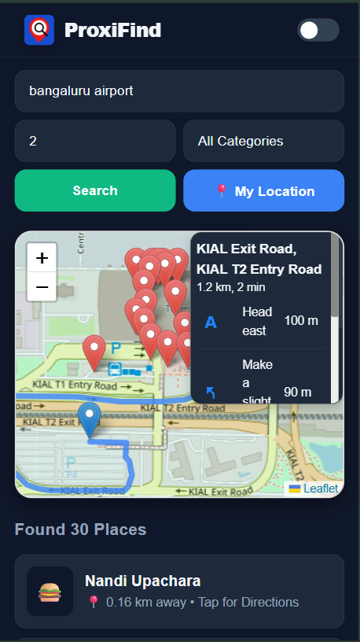 | 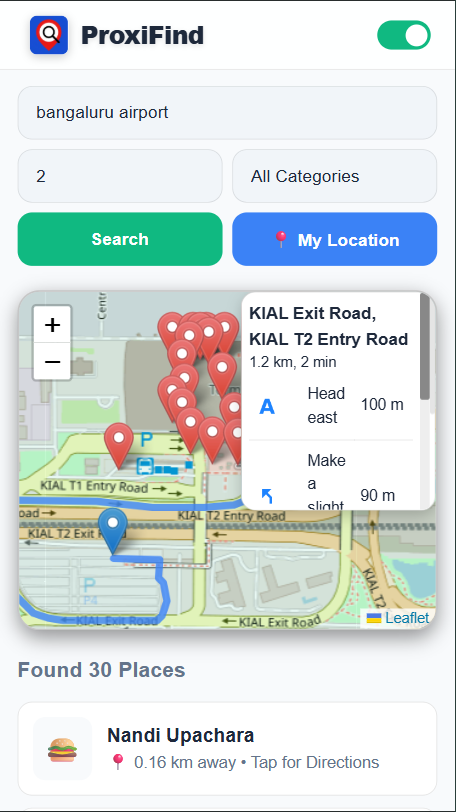 | 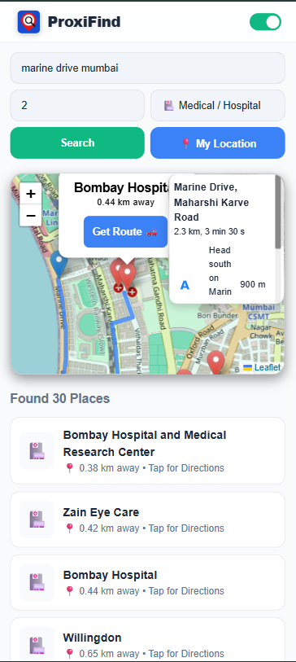 |

| **GPS Tracking (Dark)** | **GPS Tracking (Light)** | **Places Card** |
| :---: | :---: | :---: |
| 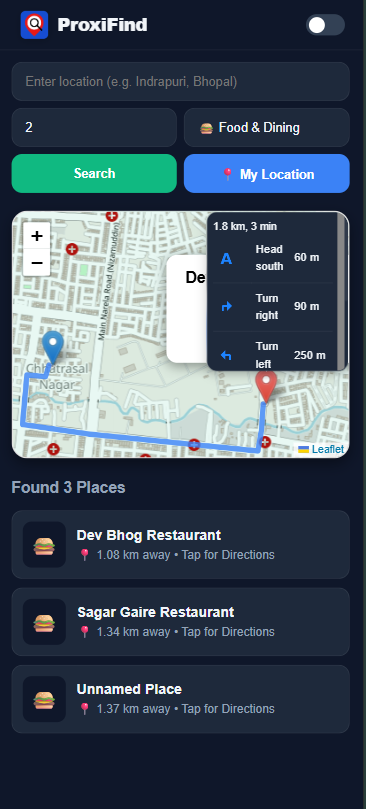 | 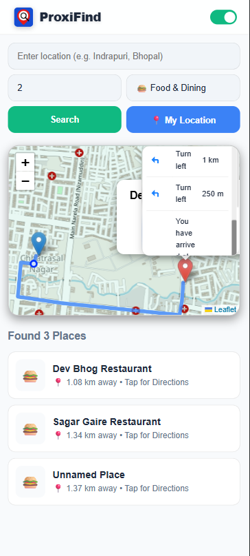 | 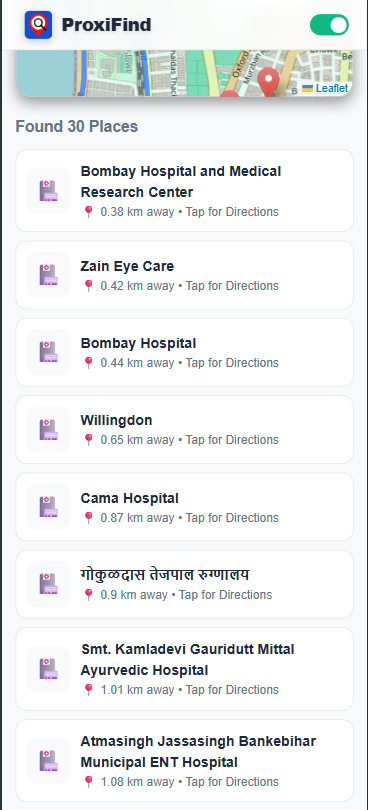 |


### 💻 Desktop Dashboard
| **Bhopal Junction (Dark Theme)** | **Indore Airport (Light Theme)** |
| :---: | :---: |
| 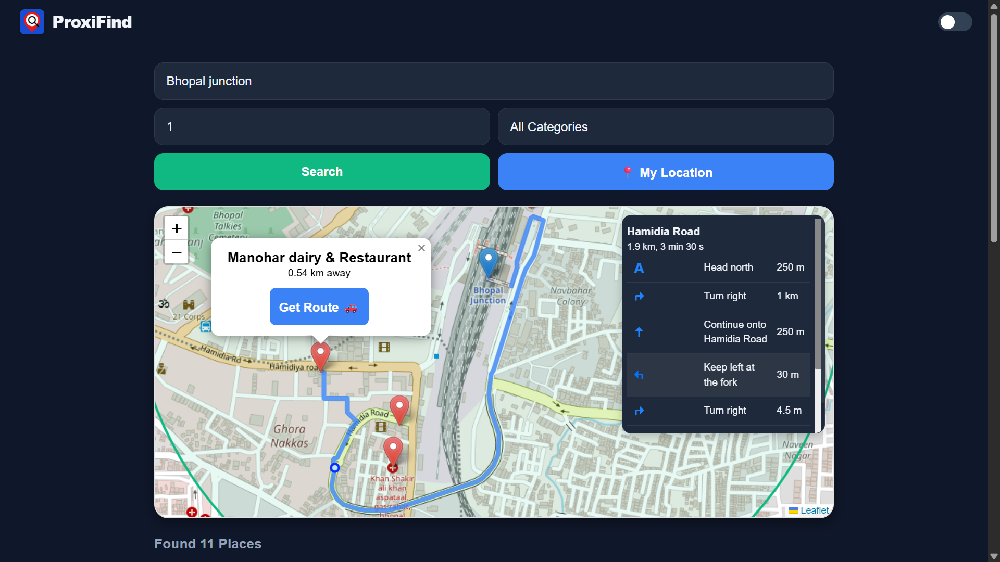 | 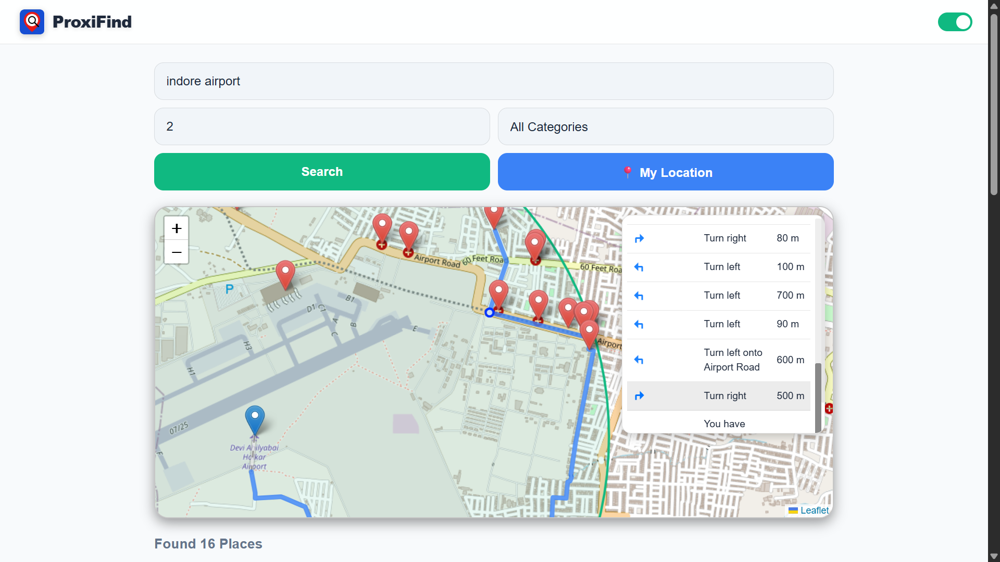 |

| **Categories & Filtering** | **Detailed Places View** |
| :---: | :---: |
| 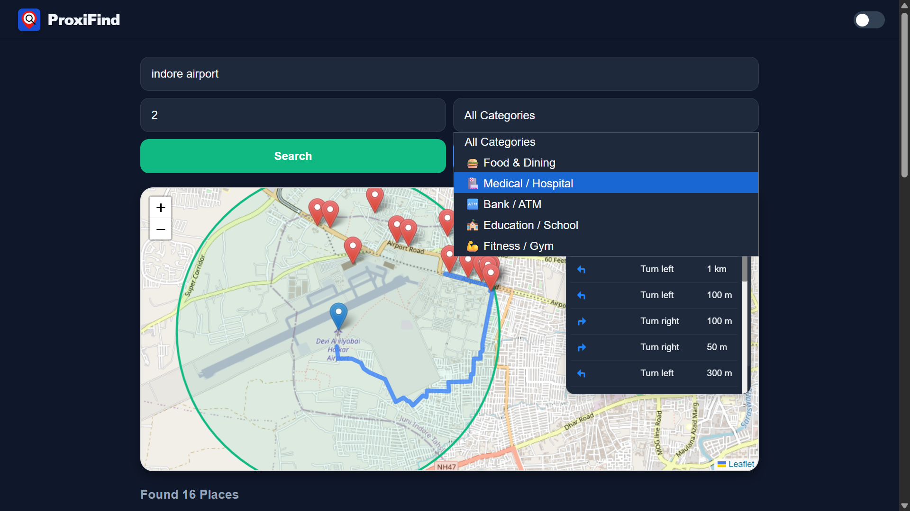 | 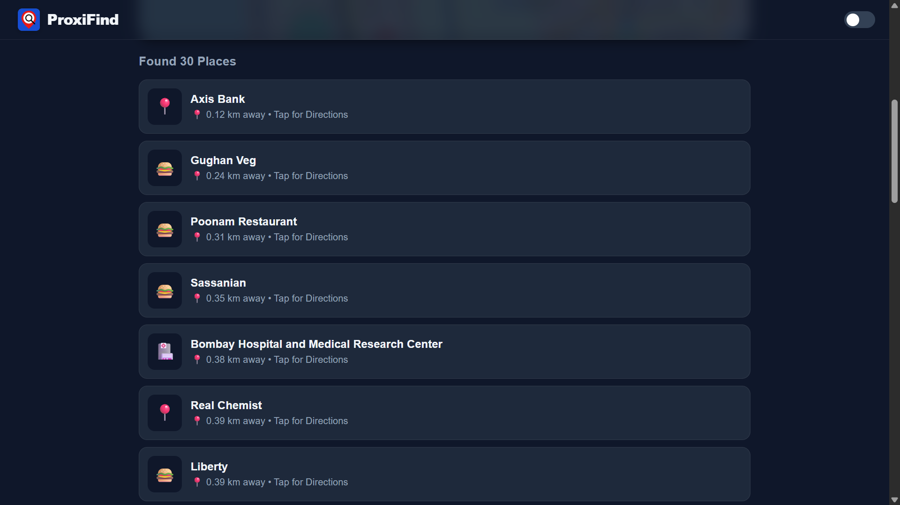 |


### 🗺️ Location-Specific Previews
| **Marine Drive (Dark)** | **Indore Airport (Dark)** |
| :---: | :---: |
| 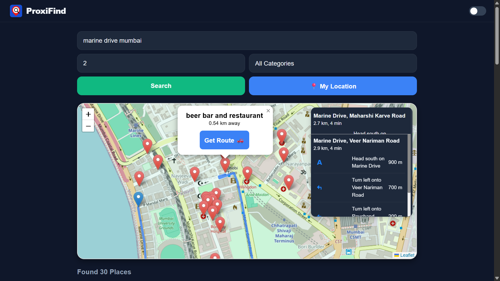 | 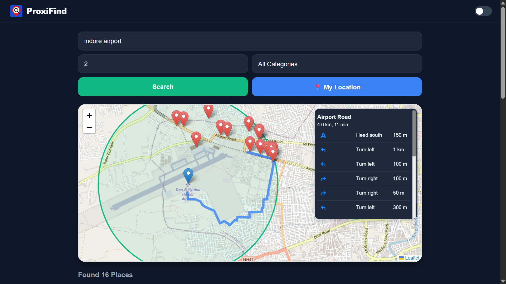 |


## 🛠️ Tech Stack

- **Backend:** `Python` (Flask)
- **Frontend:** `HTML5`, `CSS3` (Glassmorphism), `JavaScript` (ES6)
- **Maps & Location:** `Leaflet.js`, `OpenStreetMap`, `Overpass API`
- **Mathematics:** `Haversine Formula` for distance calculation.


## 📂 Project Structure

```text
PROXIMITY-SERVICE-FINDER/
├── app.py                 
├── main.py                
├── requirements.txt       
├── Output-images/         
│   ├── Mobile-Dashboard/   
│   └── PC-Dashboard/       
├── static/              
│   ├── style.css
│   └── script.js
└── templates/              
    └── index.html
````
## ⚙️ How to Run
1. **Clone the repository:**
   ```bash
   git clone [https://github.com/RootSyntax-Dev/ProxiFind.git](https://github.com/RootSyntax-Dev/ProxiFind.git)
   ```

2. **Install dependencies:**
   ```bash
   pip install -r requirements.txt
   ```

3. **Run the application:**
   ```bash
   python app.py

## 👤 Author

**Vinay Shah**
* 🎓 **Final Year B.Tech Student (CSE-AIML)**
* 💻 **Passionate Developer & AI Enthusiast**
* 🌐 **GitHub:** [@RootSyntax-Dev](https://github.com/RootSyntax-Dev)

<p align="center">
  <br>
  <a href="https://www.linkedin.com/in/vinay-py-dev/">
    
  </a>
  <br><br>
  Developed with ❤️ by <b>RootSyntax-Dev</b>
</p>
